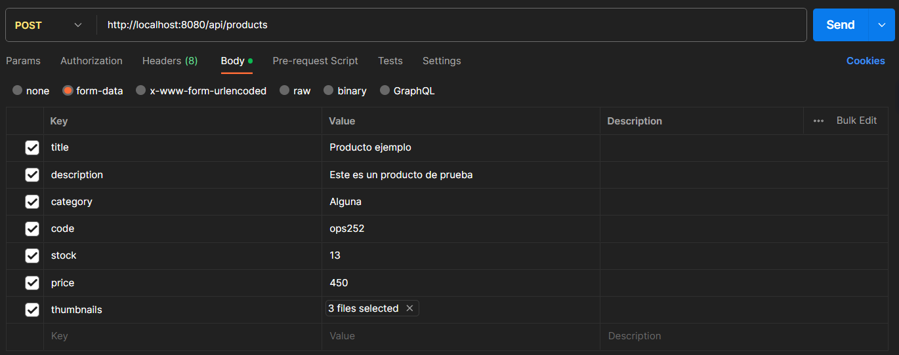
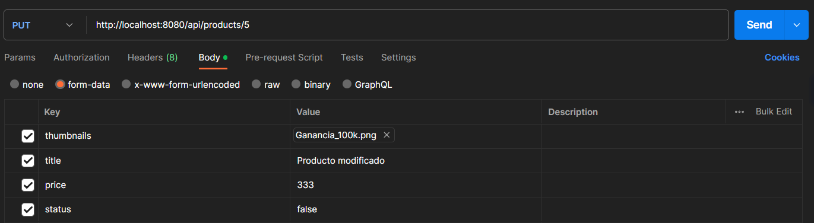
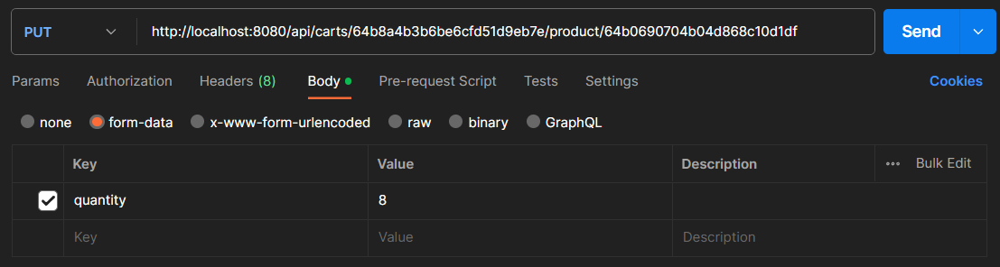
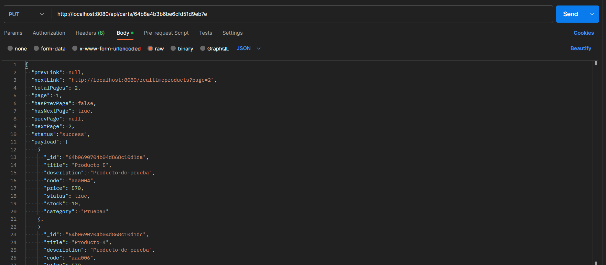

<h1 align="center">Backend - Segunda preEntrega</h1>

## 🛠️ Ejecución del proyecto

**Para la ejecución del proyecto se debe clonar el mismo y ejecutar el siguiente comando:**

`npm install`

**Luego de esto ejecutar:**

`npm start`

**o bien, pararse en la capeta "src" y ejecutar:**

`nodemon ./app.js`

## ⚙️ Configuración del proyecto:

**Recuerda crear tu propio archivo .env dentro de la carpeta src, en el que incluirás la variable de entorno necesaria para el funcionamiento. La misma será:** 

- `DATABASE_URL`: URL de tu base de datos de MongoDB Atlas.

## ⚒️ Testeo del proyecto:

### Puede visitar los siguientes enlaces para acceder a diferentes vistas:

- http://localhost:8080 
    **En esta página encontrará el listado de productos actuales cargados a la base de datos.**

- http://localhost:8080/realtimeproducts 
    **En esta página encontrará el listado de productos cargados a la base de datos actualizados en tiempo real.**

- http://localhost:8080/chat 
    **En esta página encontrará el listado de productos cargados a la base de datos actualizados en tiempo real.**

- http://localhost:8080/products
    **En esta página encontrará el listado de productos cargados a la base de datos con su paginación respectiva.**

- http://localhost:8080/carts/ <id de un cart>
    **En esta página encontrará el listado de productos en el cart con el id especificado.**

### Para las request, utilice el siguiente formato:

**El siguiente ejemplo muestra un POST de un producto, recuerde que podrá prescindir del campo "thumbnails" si así lo desea.**

**El siguiente es un ejemplo de un PUT de un producto, en el cual podrá actualizar tantos campos como considere necesario.**

**El siguiente es un ejemplo de un PUT de un cart, en el cual podrá actualizar únicamente el valor quantity.**

**Por último un ejemplo de un PUT de un cart mediante un array de productos.**

